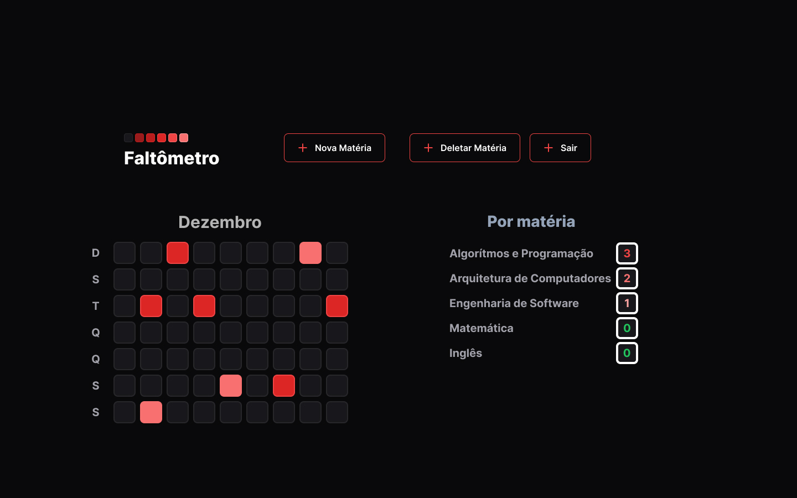
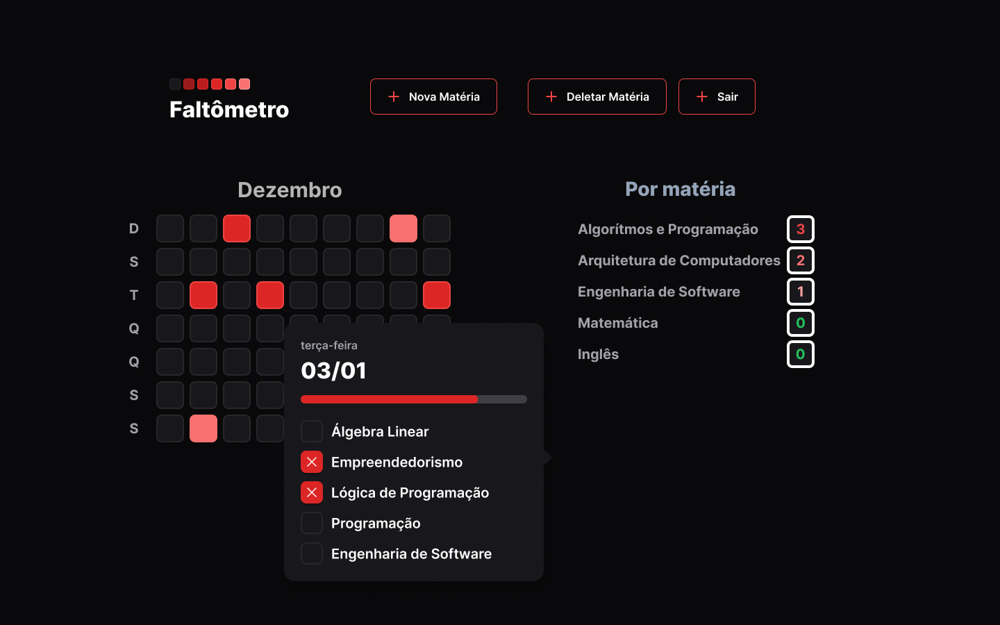
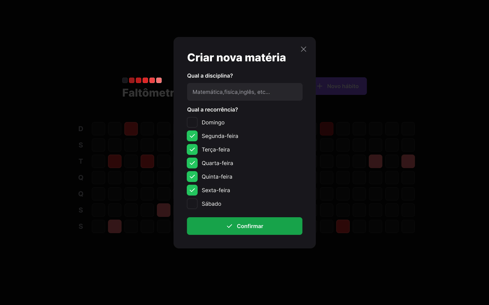
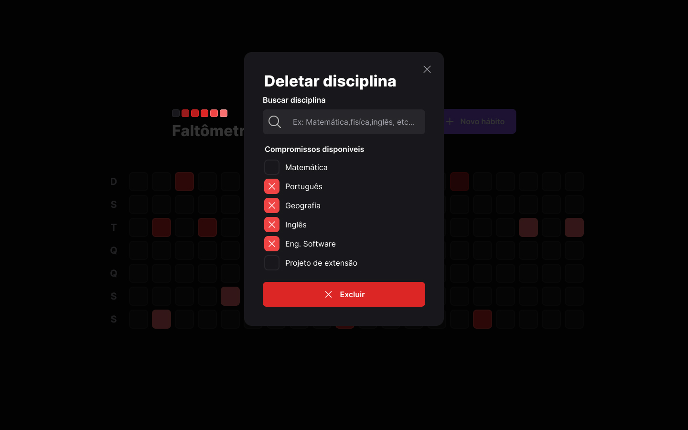
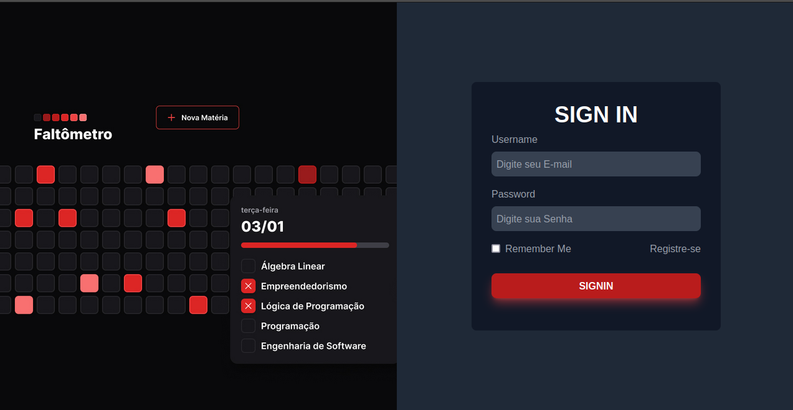
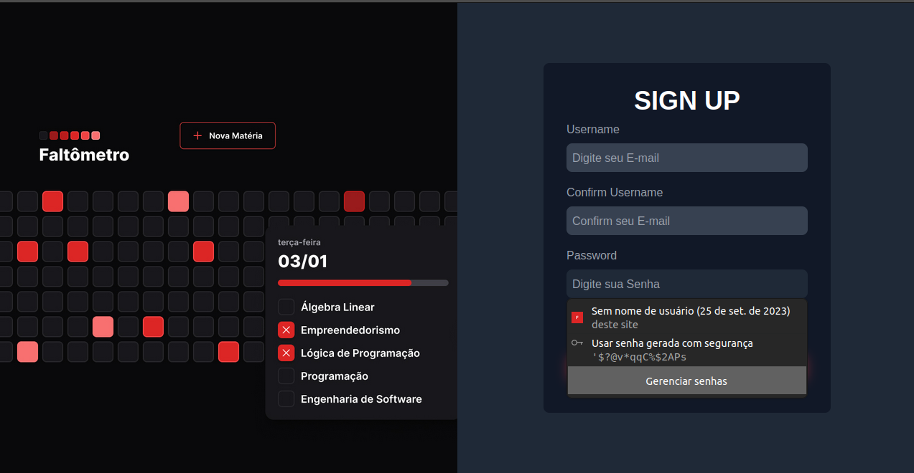

<div align="center" id="top">
  

  &#xa0;


  <a href="#">Demo</a>
</div>

<h1 align="center">Faltomêtro</h1>

<p align="center">
  

  

  

  

  

  

  
</p>


<hr>

<p align="center">
  <a href="#-sobre">Sobre</a> &#xa0; | &#xa0;
  <a href="#telas-da-aplicação">Telas</a> &#xa0; | &#xa0;
  <a href="#skateboard-funcionalidades">Funcionalidades</a> &#xa0; | &#xa0;
  <a href="#rocket-tecnologias">Tecnologias</a> &#xa0; | &#xa0;
  <a href="#white_check_mark-requisitos-para-rodar-a-aplicação">Requisitos</a> &#xa0; | &#xa0;
  <a href="#checkered_flag-iniciando">Iniciando</a> &#xa0; | &#xa0;
  <a href="#-configurações-adicionais-ao-projeto">Schemas</a> &#xa0; | &#xa0;
  <a href="#memo-licença">Licença</a> &#xa0; | &#xa0;
  <a href="https://github.com/juniorvilas" target="_blank">Autor</a>
</p>

<br>

## 😸 Sobre ##

--------------------------Falar sobre o projeto----------------------------------------------

## Telas da aplicação

### Home Desktop ##



## Nova Disciplina Desktop ##



## Deletar Disciplina Desktop ##




## Login Desktop ##



## Cadastro de novo usuário Desktop ##



## :skateboard: Funcionalidades ##

:heavy_check_mark: Criar um nova disciplina\
:heavy_check_mark: Iniciar sessão do usuário\
:heavy_check_mark: Cadastrar novos usuários\
:heavy_check_mark: Deletar disciplinas\
:heavy_check_mark: Mostrar tela home com disciplinas criadas e progresso\
:heavy_check_mark: Marcar disciplina como falta ou sem falta\
:heavy_check_mark: Aplicação responsiva

## :rocket: Tecnologias ##

Abaixo poderá ter acesso às principais tecnologias usadas neste projeto

- [ReactNative](https://reactnative.dev/)
- [NativeBase](https://nativebase.io/)
- [Expo](https://expo.dev/)
- [AndroidStudio](https://developer.android.com/studio)
- [TypeScript](https://www.typescriptlang.org/)
- [Svg-Transformer](https://github.com/kristerkari/react-native-svg-transformer)
- [Phosphor Icons](https://github.com/duongdev/phosphor-react-native)
- [Prisma](https://www.prisma.io/)
- [Fastfy](https://www.fastify.io/)
- [Tailwindcss](https://tailwindcss.com/)
- [NativeWind](https://www.nativewind.dev/)
- [Radix-ui](https://www.radix-ui.com/)
- [React-native-vector-icons](https://oblador.github.io/react-native-vector-icons/)
- [React-Native-Reanimated](https://docs.swmansion.com/react-native-reanimated/)


## :white_check_mark: Requisitos para rodar a aplicação ##
1° Não usar o pc na Xuxa

2° Você precisa ter [Git](https://git-scm.com) e [Node](https://nodejs.org/en/) instalado em seu sistema operacional, a CLI do Expo e o app Expo Go.Não sabe como fazer isso? Ai abaixo tem uma documentação para ajudar você nesse processo [CLIdoExpo](https://efficient-sloth-d85.notion.site/Instalando-Expo-a4042eaea57d40fabeeaa2e462424ff0).

## :checkered_flag: Iniciand Frontend Mobile  ##

```bash
# Clone este projeto
$ git clone https://github.com/AlcivanLucas/Faltometro.git

# Acesse
$ cd/Faltometro

# Instale as dependências
$ npm i

# Execute o projeto
$ npx expo start
```

## :checkered_flag: Iniciando Frontend Web  ##

```bash
# Clone este projeto
$ git clone https://github.com/AlcivanLucas/Faltometro.git

# Acesse
$ cd/faltometro/Web

# Instale as dependências
$ npm i

# Execute o projeto
$ npm run dev
```

## :checkered_flag: Iniciando Backend (server)  ##

```bash
# Clone este projeto
$ git clone https://github.com/AlcivanLucas/Faltometro.git

# Acesse
$ cd/Faltometro/Server

# Instale as dependências
$ npm i

# Execute o projeto
$ npm run dev
```


## 📡 Material complementar para o projeto ##


## :memo: Licença ##

Este projeto está sob licença MIT. Para mais informações acesse [LICENSE]().

Feito com :heart: por <a href="https://github.com/AlcivanLucas" target="_blank">Alcivan Lucas</a>

&#xa0;

<a href="#top">Voltar ao topo</a>
